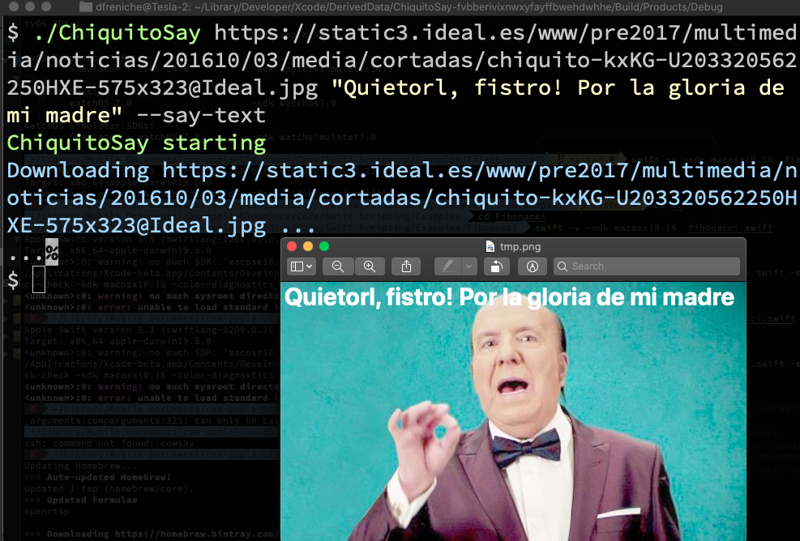

# ChiquitoSay

Example of a command-line macOS app.

This has been used as an example in the talk I gave for the NSCoder Madrid Meetup group. Talk was recorded and is available [here in Youtube](https://www.youtube.com/watch?v=hFjWAq56nkU). Slides used are [here in PDF format](Swift-Scripting.pdf). 

## What it does

It downloads an image (you provide the URL), then prints some text over that image, shows the image. Optionally can also speak out loud that text and / or print that text in banner format. 

## Features

- Modern Swift 5.3, Xcode 12, CLI macOS app
- Argument parsing using SwiftArgumentParser Apple Package
- Downloads an image in a background thread, using semaphores
- Prints some text over that image using Core Image / AppKit
- Saves that image to a temp file
- Shows that temp file invoking `open` command
- Prints "banner-like" messages
- Speaks out loud your text using `say` command

## Copy files

To make the banner option work, copy the folder `fonts` where the `ChiquitoSay` binary is located. Otherwise it won't show anything as couldn't load the font.

## How it looks



## How to use

```
ARGUMENTS:
  <image-url>             URL with the image to show
  <message>               The message to print

OPTIONS:
  --print-banner          Print a text banner instead of image
  --say-text              Say text aloud
  -h, --help              Show help information.
```

Example:

```
ChiquitoSay --say-text http://myimageURL.png "Print this here"
```
